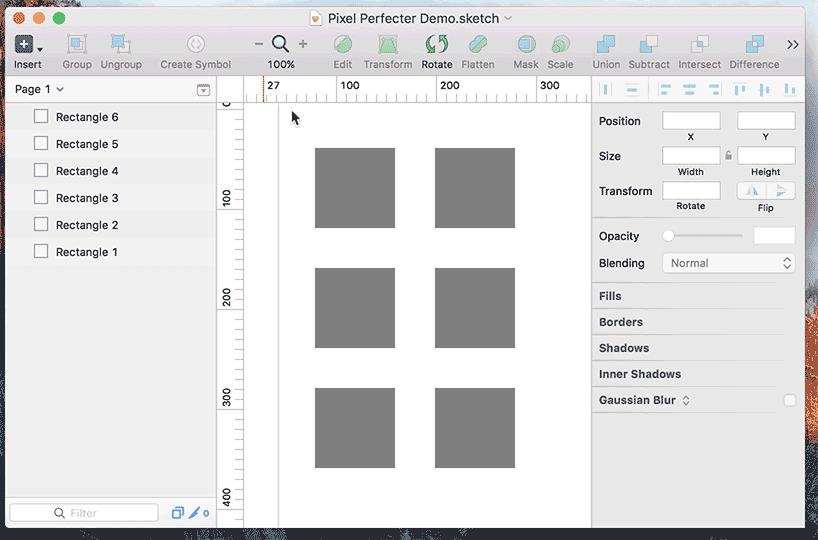
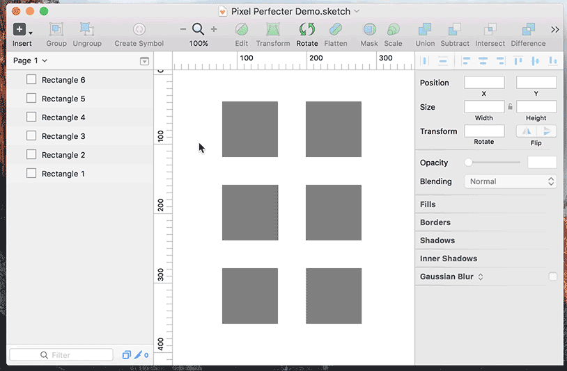

# Pixel Perfecter

This is a _very_ simple Sketch plugin that helps you find layers that have float (pixel imperfect) `X`, `Y`, `width` or `height` properties. It will help you keep your documents cleaner, and keep your design specs tight.

There are two functions available in the plugin:

## Select All Pixel Imperfect Layers

This will select all pixel imperfect layers in your current document, and show you a count of them. You can then use the `Fix Selected Pixel Imperfect Layers` function in Pixel Perfector to deal with them. It's also helpful just to know how many of those pesky layers hide throughout your document.

The keyboard shortcut for this function is <kbd>alt</kbd> + <kbd>command</kbd> + <kbd>P</kbd>

## Select One Pixel Imperfect Layer

This will select only one pixel imperfect layer in your current document. It's helpful to quickly go through all the bad layers, dealing with them on an individual basis. Calling up this function repedately will cycle through the bad layers. You can then use the `Layer → Round to Pixel` function in Sketch to deal with them.

The keyboard shortcut for this function is 
<kbd>ctrl</kbd> + <kbd>alt</kbd> + <kbd>command</kbd> + <kbd>P</kbd>

## Fix Selected Pixel Imperfect Layers

This will fix all selected pixel imperfect layers in your current document, and show you a count of those affected. It will ask you for the desired granularity:

- `1.0` will round to nearest full pixels
- `0.5` will round to nearest half pixels
- `2.0` will round to nearest double pixels

The keyboard shortcut for this function is <kbd>ctrl</kbd> + <kbd>alt</kbd> + <kbd>command</kbd> + <kbd>shift</kbd> + <kbd>P</kbd>

